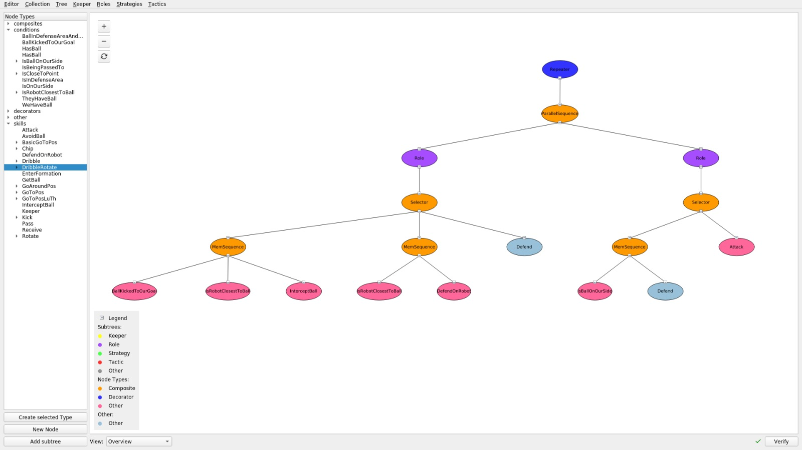

[](https://travis-ci.org/cpbscholten/RoboTeam-Twente-Behaviour-Tree-Editor-V2)
# RoboTeam Twente Behaviour Tree Editor V2.0
This repository contains the second version of the behaviour tree editor of the RoboTeam Twente and replaces the previous editor [GitHub: Roboteam Behaviour Tree Editor](https://github.com/RoboTeamTwente/roboteam_behaviour-tree-editor). 

## Installation
### Dependencies
- Python-3.7

### Setup
- Clone this repository
- Create the virtual environment: `python3 -m venv /path/to/cloned/repository`
- install requirements: `pip3 install -r requirements.txt`

## Run application
- Without heatmap demo: `python main.py`
- With heatmap simulator: `python main.py --heatmap-demo`

## Tests
Run `pytest` from the `tests` directory

## Features
- Reading and writing json tree files from filesystem
- Adding properties to nodes
- Deleting nodes, deleting subtrees and reconnecting edges
- Realigning trees, panning and zooming
- Discarding changes in the tree and collection
- Reloading collection from file system
- Opening collection from a custom location
- Saving collection to default path or a custom location
- Saving trees to default path or custom location
- Creating new nodes (`Ctrl+N`), nodes from node types from csv files (`Ctrl+T`) and creating subtrees (`Ctrl+Shift+N`)
- Creating new trees for each collection category: Keeper, Roles, Strategies, Tactics
- Legend widget:  
The legend widget in the bottom left can be used to identify the type of each node. Shortcut: `Ctrl+L`
- Verification:  
The application supports advanced tree verification. The verification runs automatically when changes are done and updates the checkmark in the right bottom corner of the main window. Hovering over this checkmark will display a tooltip with more detailed information. Verification can also be run by pressing the verify button or by using the shortcut `Ctrl+E`. The verification supports verifying the following mathematical properties:
  - Verifying if there are cycles
  - Verify if a root node exists.  
 And supports verifying the additional properties:
  - Verify if there are no unconnected nodes
  - Verify if decorators and composites only have one child
  - Verify if trees follow the Strategy -> Tactic -> Role structure
  - Verify if the `ROLE` property is inherited properly
- Settings menu  
The application supports adjusting the location of the log file, json trees and node type csv files. It also supports adjusting the default size of ids generated for new nodes and if roles should be updated automatically. The settings menu can be opened from the menu bar or with the shortcut `Ctrl+Alt+S`
- Editing multiple tree files at once:  
The editor supports editing multiple tree files at once. Switching between tree files can be done using the menubar, which will also show which files have unsaved changes.
- Multiple tree views:  
The editor supports multiple views. The main view (`F1`), with simple nodes. The info view (`F2`), which also shows all attributes and properties of nodes and 4 heatmap views (success (`F6`), waiting (`F7`), running (`F8`), failure (`F9`)). The heatmaps can be used in combination with the simulator script (run main.py with argument `--heatmap-demo`), or the message spoofer or listener made by Andrei: [GitHub](https://github.com/cjcr-andrei/rtt_data_snooper)
- Auto updating roles (experimental):  
The roles can be updated automatically in trees. This setting is disabled by default as it currently is not updated to the view of the current tree, which could cause issues. Use at your own risk.

## Project File Structure
```
project
│   README.md - Manual
│   main.py - File with main function for starting the application
|   requirements.txt - File containing dependencies of the project. Can be installed using a virtual environment
|   travis.yml - Contains the configuration of continuous integration with Travis-CI
│
└───model
│   │   config.py - Contains methods for reading and updating settings from the configuration file
│   │   exceptions.py - Contains all custom mode exceptions for the model 
│   │   tree.py - Contains all model classes for representing trees, nodetypes and contains verification methods
│   
└───view
|   │   applications.py - Contains the application initialized by the main.py file
|   │   elements.py - File containing element classes for the view, i.e. node, edge, etc.
|   |   enums.py - Contains enumarators used in the front end
|   |   listeners.py - Containing Qt signals to communicate with controller worker thread
|   |   scenes.py - Contains the scene class used for drawing the trees
|   |   widgets.py - Contains all widget classes: the node types widget, verification toolbar, legend widget, etc.
|   |   windows.py - Contains all window classes and dialogs: MainWindow, settigs menu, open and save dialogs, etc.
|   |
|   └───icon - Directory containing all icons
|
└───controller
|   |   heatmap_demo.py - File for creating mock simulator data when application is started with the --heatmap-demo argument
|   |   utils.py - File containing helper functions for reading and writing json and csv files
|   |   tree_data.py - ORM class to connect with ROS snooper database
|   |   workers.py - File containing worker thread to handle I/O from filesystem and communication with ROS
|
└───config
|   |   settings.json - Configuration file containing all settigns
|   |
|   └───node_types - Directory containing node type csv files. Retrieved from: https://github.com/RoboTeamTwente/roboteam_ai
/tree/development/roboteam_ai/src/treeinterp/config_files
|   |   *Some node types csv files*
|
└───jsons - Directory containing json tree files. Editor loads trees from the first subdirectory. Retrieved from: https://github.com/RoboTeamTwente/roboteam_ai/tree/development/roboteam_ai/src/jsons
|   |
|   └───keeper
|   |   *Some keeper json files*
|   |
|   └───roles
|   |   *Some role json files*
|   |
|   └───strategies
|   |   *Some strategy json files*
|   |
|   └───tactics
|   |   *Some tactic json files*
└───tests - Directory containing all test files
```

## Shortcuts
- Exit application: Alt+F4  
- Settings: Ctrl+Alt+S  
- Open collection: Ctrl+O  
- Reload collection from filesystem: Ctrl+Sift+R  
- Discard changes in collection: Ctrl+Shift+D  
- Save collection: Ctrl+W  
- Save collection as: Ctrl+Shift+W  
- Close tree: Ctrl+Q  
- Discard changes in current tree: Ctrl+D  
- Save tree: Ctrl+S  
- Save tree as: Ctrl+Shift+S  
- Create new keeper, role, strategy, tactic: Ctrl+1-4  
- Create node from selected node type: Ctrl+T  
- Create new node: Ctrl+N  
- Create subtree: Ctrl+Shift+n  
- Verify tree: Ctrl+E  
- Open or close legend: Ctrl+L  
- Realign tree: F5/Ctrl+R
- Zoom in: Ctrl++
- Zoom out: Ctrl+-
- Switch Views: 
    - Main view: F1
    - Info view: F2
    - Heatmap success: F6
    - Heatmap waiting: F7
    - Heatmap running: F8
    - Heatmap failure: F9

## Credits
### Contributers
Andrei Cojocaru - s1831275 - [GitHub](https://github.com/cjcr-andrei)  
Casper Plentinger - s1864335 - [GitHub](https://github.com/cplentinger)  
Christian Scholten - s1783602 - [GitHub](https://github.com/cpbscholten/)    
Mauk Muller - s1844881 - [GitHub](https://github.com/maukwm)  

### Credits
- RoboTeam Twente - https://roboteamtwente.nl/ - [GitHub: RoboTeamTwente](https://github.com/RoboTeamTwente)
- Mannes Poel (supervisor) - [University of Twente](https://people.utwente.nl/m.poel)
- Rom Langerak (Module Coordinator) - [University of Twente](https://people.utwente.nl/r.langerak)
- Icons: [Feather Icons](https://github.com/feathericons/feather) - [License](https://github.com/feathericons/feather/blob/master/LICENSE)

© 2019 - University of Twente and RoboTeam Twente
